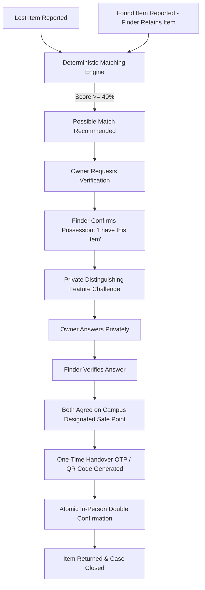
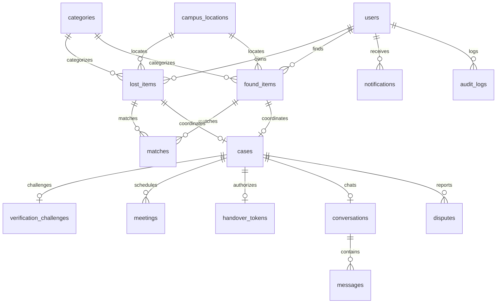

# CampusFind — Production College Lost & Found System

> **Direct Peer Handover with Finder-Retention, Deterministic Multi-Factor Matching, and Cryptographically Verified One-Time Tokens.**

CampusFind transforms collegiate lost property recovery. Unlike legacy campus systems that rely on centralized security desks or unmonitored bulletin boards, **the person who finds an item retains possession of it safely**. CampusFind identifies the possible owner using configurable multi-factor deterministic matching, coordinates safe private verification, schedules a meeting at an administrator-designated campus public safe spot, verifies the handover with a single-use 6-digit OTP/QR token, and closes the case.

---

## 1. Problem Statement & Solution

### The Legacy Problem:
* **Centralized bottleneck**: Forcing finders to deposit items with security staff results in abandoned property, administrative overhead, and poor return rates.
* **PII leakage & false claims**: Open public boards reveal phone numbers, emails, and exact distinguishing marks, inviting fraudulent claims and spam.
* **Uncertain handovers**: In-person handovers often fail due to mismatched expectations, lack of identity verification, and dispute ambiguity.

### The CampusFind Solution:
* **Finder-Retention Paradigm**: The finder keeps the item safely in hand. The item is returned directly to the verified owner.
* **Deterministic Matching Engine**: Multi-factor weighted algorithm (Category 25%, Location 20%, Date Proximity 20%, Keywords 15%, Brand 10%, Color 5%, Description 5%) calculated transparently and strictly labeled **"Possible Match"**.
* **Zero PII Leakage**: Private distinguishing questions prevent false claims; personal phone numbers and personal emails are never exposed.
* **One-Time Handover Verification**: A single-use 6-digit OTP / QR token requires atomic double-confirmation (Finder: *"I handed over"* + Owner: *"I received"*) at official campus meeting points before transitioning to `RETURNED`.

---

## 2. Core Workflow & State Machine



### Finite State Machine (FSM):
```text
LOST_REPORTED / FOUND_REPORTED
    ↓
POSSIBLE_MATCH
    ↓
MATCH_REQUESTED
    ↓
FINDER_CONFIRMED
    ↓
VERIFICATION_PENDING
    ↓
VERIFIED
    ↓
MEETING_PROPOSED
    ↓
MEETING_CONFIRMED
    ↓
HANDOVER_PENDING
    ↓
RETURNED
    ↓
CLOSED
```

*Transitions into `DISPUTED` are available at any stage if a no-show, harassment, or item damage occurs, freezing the case for administrative human review.*

---

## 3. Architecture Overview

CampusFind is structured using **Clean Architecture** principles:

```text
campusFind/
├── backend/
│   ├── app/
│   │   ├── api/v1/          # RESTful routers (auth, lost, found, matches, cases, meetings, handover, chat, admin, disputes, map)
│   │   ├── core/            # Config, database, security (bcrypt, JWT), state machine, exceptions
│   │   ├── models/          # Normalized SQLAlchemy 2.0 ORM models
│   │   ├── schemas/         # Pydantic v2 validation contracts
│   │   ├── services/        # Matching engine, handover token service, duplicate detector, notifications, audit
│   │   ├── websocket/       # Real-time WebSocket connection manager for chat & notifications
│   │   └── utils/           # Database seeding, mock data, and image handling
│   ├── tests/               # Pytest automated test suite (Auth, FSM, Matching, Handover, Disputes)
│   ├── Dockerfile
│   └── requirements.txt
├── frontend/
│   ├── src/
│   │   ├── components/      # StatusTimeline, ItemCard, MatchCard, CaseChat, HandoverModal, CampusMapVisualizer
│   │   ├── contexts/        # AuthContext, ToastContext
│   │   ├── pages/           # Public (Landing, Login, Register, Search, Map), Student (Dashboard, Reports, CaseDetail), Admin
│   │   └── services/        # Axios API clients
│   ├── Dockerfile
│   └── package.json
└── docker-compose.yml       # Production orchestration (PostgreSQL, Redis, FastAPI, React/Nginx)
```

---

## 4. Database Entity-Relationship Diagram



---

## 5. Security & Privacy Architecture

* **Role-Based Access Control (RBAC)**: Enforced via FastAPI dependency injection:
  * `STUDENT`: Report lost/found, search, chat, coordinate, confirm handover.
  * `ADMIN`: Manage campus locations, categories, disputes, user suspension, audit logs.
  * `SUPER_ADMIN`: Promote administrators, update college email domains, adjust matching algorithm weights.
* **Institutional Domain Validation**: Configurable via `COLLEGE_EMAIL_DOMAIN=example.edu` (rejects non-college domains).
* **Zero PII Exposure**: Personal emails and phone numbers are never returned in public or match queries.
* **Bcrypt Direct Hashing**: Passwords hashed with salt rounds; JWT access & refresh tokens rotated.
* **Race Condition Prevention**: Database transactions and concurrency row-level locking (`with_for_update()`) prevent double claims on the same found item.
* **Single-Use Handover Token**: 6-digit OTP code expires in 30 minutes and is atomically invalidated upon double confirmation.

---

## 6. Production Authentication & Administration

In this production-ready deployment:
* **Standard Student Authentication**: Users register using their institutional college email (e.g. `@lpu.in`). Public interfaces contain **no bypass buttons or demo credentials**, ensuring authentic credential checks.
* **Super Admin Initialization**: When deploying on a new database, the first user who registers automatically receives the `SUPER_ADMIN` role. Subsequent registrants receive standard `STUDENT` accounts.
* **Role-Based Access Control (RBAC)**: Only accounts with `ADMIN` or `SUPER_ADMIN` roles can view administrative navigation links or access `/admin` endpoints. Any unauthorized user attempting to access admin routes is rejected by JWT verification (`HTTP 403 Forbidden`).
* **Seeded Administrator Account (for deployment / evaluation)**:
  * Email: `admin@lpu.in`
  * Role: `ADMIN`
  * Handled via secure backend seeding (`python -m app.utils.seed_data`) or environment initialization.

---

## 7. Quickstart & Local Setup

### Prerequisites
* Python 3.11+
* Node.js 18+ & npm
* (Optional) Docker & Docker Compose

### 1. Backend Setup:
```bash
cd backend
python -m venv venv
# On Windows:
.\venv\Scripts\activate
# On Linux/macOS:
source venv/bin/activate

pip install -r requirements.txt
python -m app.utils.seed_data
uvicorn app.main:app --reload --port 8000
```
Backend API will be running at `http://localhost:8000`. Interactive OpenAPI documentation available at `http://localhost:8000/docs`.

### 2. Frontend Setup:
```bash
cd frontend
npm install
npm run dev
```
Frontend web application will be live at `http://localhost:5173`.

---

## 8. Docker Deployment

Launch the full production stack (FastAPI backend, React Nginx frontend, PostgreSQL database, and Redis):

```bash
docker compose up --build
```

Access:
* **Web Application**: `http://localhost:3000`
* **Backend API & Swagger**: `http://localhost:8000/docs`
* **PostgreSQL**: `localhost:5432`

---

## 9. Running Automated Tests

Run the Pytest suite covering authentication, deterministic matching, state machine enforcement, and handover verification:

```bash
cd backend
.\venv\Scripts\pytest -v
```

Expected result:
```text
tests/test_auth.py::test_register_invalid_domain PASSED
tests/test_auth.py::test_register_valid_domain PASSED
tests/test_auth.py::test_login_success PASSED
tests/test_auth.py::test_login_invalid_password PASSED
tests/test_handover.py::test_handover_full_lifecycle PASSED
tests/test_matching.py::test_matching_high_score_same_details PASSED
tests/test_matching.py::test_matching_different_category_low_score PASSED
tests/test_state_machine.py::test_valid_forward_transitions PASSED
tests/test_state_machine.py::test_disallowed_backward_transition PASSED
tests/test_state_machine.py::test_dispute_transitions PASSED
========== 10 passed in 4.7s ==========
```

---

## 10. SDE Portfolio Talking Points

When discussing **CampusFind** in software engineering interviews, highlight:
1. **Clean Architecture Separation**: Pure division between API routers, domain services, database models, and repository queries.
2. **Deterministic Multi-Factor Scoring**: Weighted mathematical model combining Jaccard token overlap, temporal decay, and spatial proximity.
3. **Finite State Machine Rigor**: Explicit transition validation matrix preventing invalid lifecycle leaps (e.g. `RETURNED -> POSSIBLE_MATCH`).
4. **Concurrency & Atomicity**: Handling race conditions when multiple students attempt to claim a found item simultaneously.
5. **Bidirectional WebSockets**: Integrated real-time temporary private chat and notification streams without third-party external dependencies.
